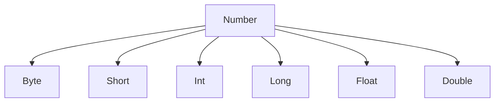

# Generic

컬렉션을 다루는 라이브러리 함수는 대부분 제네릭 함수이다.
아래는 제네릭 함수의 모양을 살펴보자.

```kotlin
// 가장 먼저 <T>로 타입 파라미터를 선언한다.
// 선언된 타입 파라미터가 수신 객체와 반환 타입에 그대로 쓰인다.
fun <T> List<T>.slice(indices: IntRange): List<T>
```

리스트에 대해 호출할때 타입 인자를 명시적으로 지정할 수 있지만 보통은 컴파일러가 타입 추론을 통해 생략할 수 있다.


## 제네릭 클래스

자바와 마찬가지로 타입 파라미터를 넣은 꺽쇠 기호를 클래스 이름 뒤에 붙이면 클래스를 제네릭하게 만들 수 있다.

```kotlin
interface List<T> {
    operator fun get(index: Int): T
    // ...
}
```

## 타입 파라미터 제약조건
타입 파라미터 제약조건은 클래스나 함수에 사용할 수 있는 타입 인자를 제한하는 기능이다.

예를 들어 리스트에 모든 원소의 합을 구하는 `sum`이라는 함수를 만든다고 하면 타입으로 Int나 Double은 함수에 적용할 수 있으나 String은 얘기가 다르다.
이런 경우 타입 파라미터를 숫자 타입만을 허용하게 하면 된다.

어떤 타입을 제네릭 타입의 타입 파라미터에 대한 상한(upper bound)으로 지정하면 제네릭 타입을 인스턴스화 할 때 사용하는 타입 인자는 반드시 그 상한 타입이거나 그 상한타입의 하위 타입(subtype, subclass)이어야 한다.

```kotlin
fun <T : Number> List<T>.sum(): T // 상한 타입은 Number이다.
```

Number를 상한으로 가지는 (Number를 상속하는) 클래스는 다음과 같다.



따라서 Number를 상속하는 하위 타입들은 다 사용할 수 있다.

때로는 상한 타입을 두개를 가져야 할 수도 있는데 다음과 같이 정의할 수 있다.

```kotlin
fun <T> ensureTrailingPeriod(seq: T) 
  where T: CharSequence, T: Appendable { // 제약조건의 목록이다.
    if (!seq.endsWith('.')) {
        seq.append('.')
    }
  }
```

### nullable과 non-null

코틀린 제네릭에서는 아무 제약조건 없는 제네릭은 결과적으로 `Any?`를 상한으로 정한 파라미터와 같다.

```kotlin
class Processor<T> {
    fun process(value: T) {
        value?.hashCode() // value는 nullable 이다.
    }
}

class Processor<T: Any> {
    fun process(value: T) {
        value.hashCode() // value는 non-null 이다.
    }
}
```

## 런타임에서의 제네릭의 동작

### 소거된 타입 파라미터와 실체화된 타입 파라미터

JVM의 제네릭은 보통 타입소거(type erasure)를 사용해 구현된다. 이는 런타임에 제네릭 클래스의 인스턴스에 타입 인자 정보가 들어있지 않다는 뜻이다.
이것이 어떤 영향을 미치는지, inline 함수를 선언함으로써 이런 제약을 어떻게 우회할 수 있는지 살펴본다. 이를 코틀린에서는 `실체화(reify)`라 부른다.

### 런타임에서의 제네릭, 타입 검사와 캐스팅

JVM에서 런타임에서 제네릭은 타입 인자 정보는 지워진다. `List<String>` 객체를 만들었다면 런타임에서는 List 안에 어떤 타입을 저장하는지 알수가 없다.

컴파일러는 리스트들을 구분할 수 있지만 런타임에서는 List들은 완전히 같은 타입의 객체다. 그래도 컴파일러 덕분에 그 객체에는 올바른 타입만 들어있다고 추론할 수 있다.

그래서 is 검사에서 타입 인자로 지정한 타입을 검사할 수가 없다.

```kotlin
val value = listOf("", 1)
if (value is List<String>) {} // 타입 소거와 관련돼 컴파일 단계에서 에러가 발생한다.
```

그래도 타입 정보의 크기가 줄어들어서 전반적인 메모리 사용량이 줄어든다는 타입 소거의 장점도 있다.
그렇다면 리스트를 is 검사를 하기위해선 어떻게 해야할까, 바로 스타 프로젝션(star projection)을 이용하면 된다.
자바의 `List<?>`와 비슷하다.

```kotlin
if(value is List<*>) {}
```

### 실체화한 타입 파라미터를 사용한 함수 선언

코틀린 제네릭 타입의 타입 인자 정보는 런타임 시점에 지워진다.
따라서 제네릭 클래스의 인스턴스가 있어도 그 인스턴스를 만들때 사용한 타입 인자를 알아낼 수 없다.

```kotlin
fun <T> isA (value: Any) = value is T
// Error: Cannot check for instance of erased type: T
```

인타인 함수는 타입 파라미터가 실체화되므로 런타임에 타입 인자를 알 수 있다.
위 함수를 인라인 함수로 만들고 타입 파라미터를 `reified`로 지정하면 value의 타입이 T의 인스턴스인지 런타임에 검사할 수 있다.

```kotlin
inline fun <reified T> isA(value: Any) = value is T
```

이는 성능과 별도로 실체화를 목표로 한 코드이다. 인라인 함수는 인라이닝을 함으로써 얻는 이득이 더 많을 경우에만 만들어야한다.

### 실체화한 타입 파라미터로 클래스 참조 대신

표준 자바 API ServiceLoader를 사용해 서비스를 읽어 들이려먼 다음과 같이 호출해야한다.

```kotlin
val serviceImpl = ServiceLoader.load(Service::class.java)
```

이를 인라이닝하여 표현한다면 다음과 같다.

```kotlin
private inline fun <reified T> loadService(): ServiceLoader<T>? {
    return ServiceLoader.load(T::class.java)
}

val serviceImpl = loadService<Service>()
```

## 제네릭 하위타입 안정성

만약 `List<Any>` 리스트에 원소로 `String`를 넘긴다면 어떨까? String은 Any의 하위 타입이므로 문제 없다고 볼 수 있으나, 만약 Any에 String과 Int가 같이 들어있다면 문제가 있을 수 있다. 그래서 코틀린 컴파일러는 이를 금지한다.

`MutableList<String>`은 `MutableList<Any>`의 하위 타입으로 봐서는 안된다.
제네릭 타입을 인스턴스화 할때, 타입 인자로 서로 다른 타입이 들어갔을때 그 타입 사이의 하위 타입 관계가 성립하지 않으면 그 제네릭 타입을 무공변(invariant)라 한다. 자바에서는 모든 클래스가 무공변이다.

## 공변성


